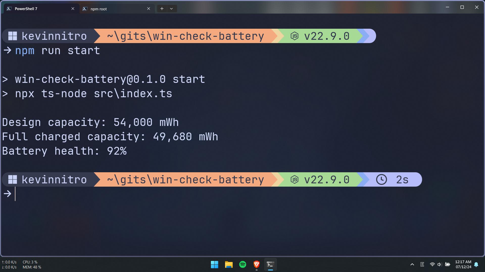

# WIN CHECK BATTERY

Check battery health for Windows

---

## TABLE OF CONTENTS

<!-- START doctoc generated TOC please keep comment here to allow auto update -->
<!-- DON'T EDIT THIS SECTION, INSTEAD RE-RUN doctoc TO UPDATE -->

- [USAGE](#usage)
  - [Command](#command)
  - [Executable file](#executable-file)
- [PREVIEW](#preview)
- [DEV](#dev)

<!-- END doctoc generated TOC please keep comment here to allow auto update -->

---

## USAGE

### Command

> [!IMPORTANT]
> Require [NodeJS](https://nodejs.org/en/download/)

```sh
npx win-check-bat
```

### Executable file

> [!NOTE]
> Ouhm... not yet

---

## PREVIEW



---

## DEV

```sh
npm i
npm run dev
```
